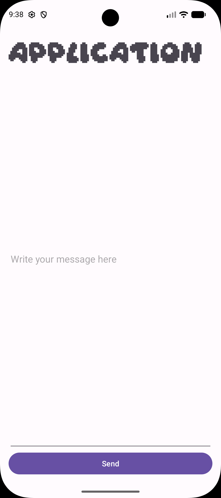
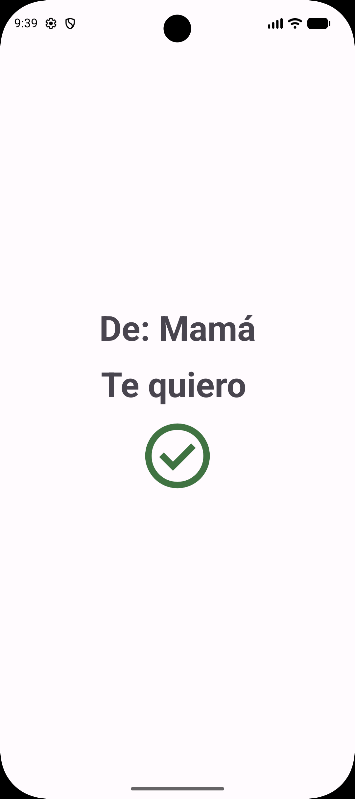

# SendMessage 📱

**SendMessage** es una app de **Android development** escrita en **Kotlin** que permite escribir un mensaje en la pantalla principal y mostrarlo en una segunda pantalla, transfiriendo el dato entre *Activities* mediante `Intent` y `Bundle`. Demuestra el paso de objetos `Parcelable`, el ciclo de vida de las Activities, layouts XML con Material Design y modo *Edge-to-Edge*.

---

## 📸 Capturas de pantalla

| Pantalla | Descripción | Captura |
| --- | --- | --- |
| Envío | Formulario inicial donde el usuario escribe el texto |  |
| Mensaje | Activity de destino que muestra el mensaje recibido |  |

---

## 🚀 Características

- **Paso de datos entre Activities:** `SendMessageActivity` crea un `Intent`, empaqueta un objeto en un `Bundle` con la clave `KEY_MESSAGE` y lanza `ViewMessageActivity`, que lo recupera y lo muestra.
- **Modelo de datos Parcelable:** clases `Message` (`id`, `content`, `sender`, `receiver`) y `Person` (`dni`, `name`, `surname`) anotadas con `@Parcelize` (plugin `kotlin-parcelize`).
- **Interfaz con layouts XML:** pantallas construidas con `LinearLayout`, `EditText`, `Button`, `TextView` e `ImageView`, con tema Material y fuente personalizada `font/day_dream_demo`.
- **Edge-to-Edge:** `ViewMessageActivity` invoca `enableEdgeToEdge()` y adapta los insets del sistema.
- **Ciclo de vida y diagnóstico:** trazas de `onCreate()`, `onStart()`, `onResume()`, `onPause()`, `onStop()` y `onDestroy()` en Logcat mediante `Log.d()`.

---
## 📁 Estructura del Proyecto

```text
SendMessage/
├── app/
│   └── src/
│       └── main/
│           ├── java/com/example/sendmessage/
│           │   ├── SendMessageActivity.kt  # Activity principal para ingresar y enviar el mensaje
│           │   ├── ViewMessageActivity.kt  # Activity de destino para visualizar el mensaje
│           │   └── SendMessageApplication.kt
│           └── res/
│               ├── layout/                 # Archivos de diseño XML (activity_send_message.xml, activity_view_message.xml)
│               ├── values/                 # Cadenas de texto, dimensiones, colores y temas
│               └── navigation/             # Grafo de navegación (nav_graph.xml)
├── build.gradle.kts                        # Configuración Gradle a nivel de proyecto
└── README.md                               # Documentación del proyecto
```

---

## 🏗️ Arquitectura y stack tecnológico

La app sigue una **arquitectura lineal sencilla** (sin MVVM/MVI): `SendMessageActivity` captura el texto, construye un objeto `Message` y lo envía a `ViewMessageActivity` a través de `Intent` + `Bundle`. La presentación se resuelve íntegramente con **layouts XML** inflados mediante `setContentView()` y `findViewById()`.

| Capa | Tecnología |
| --- | --- |
| Lenguaje | Kotlin |
| UI | XML layouts, Material Components, ConstraintLayout, fuentes personalizadas |
| Navegación | `Intent` + `Bundle` entre 2 Activities |
| Modelo de datos | `Message` y `Person` con `@Parcelize` (`kotlin-parcelize`) |
| AndroidX | `core-ktx`, `activity-ktx`, `appcompat`, `constraintlayout` |
| Tests | JUnit4, AndroidX JUnit, Espresso |
| Documentación | Dokka 2.2.0 → HTML en `documentation/` |
| Compilación | Gradle 9.5.0 + AGP 9.3.3, `minSdk 24`, `targetSdk 37`, Java 11 |

> **Nota:** `res/navigation/nav_graph.xml` y las dependencias `navigation-fragment-ktx` / `navigation-ui-ktx` son restos de la plantilla de Android Studio (referencian `FirstFragment`/`SecondFragment`, que no existen). La navegación real es por `Intent`.

### Requisitos del entorno

| Requisito | Versión |
| --- | --- |
| Android Studio | Versión compatible con AGP 9.x |
| JDK | 11 (`sourceCompatibility`/`targetCompatibility = JavaVersion.VERSION_11`) |
| Gradle | 9.5.0 (wrapper incluido en el repo) |
| Android SDK | `compileSdk`/`targetSdk` 37 · `minSdk` 24 (Android 7.0) |

---

## 🛠️ Cómo ejecutar el proyecto (Getting Started)

### Prerrequisitos

- **Android Studio** instalado (versión compatible con AGP 9.x).
- **JDK 11** o superior configurado en Android Studio (`File > Settings > Build Tools > Gradle > Gradle JDK`).
- **Dispositivo Android** con depuración USB activada, o un **emulador (AVD)**.

### Pasos

1. **Clonar o abrir el proyecto** en Android Studio (`File > Open…`).
2. Esperar a que **Gradle** sincronice las dependencias del proyecto.
3. Conectar un dispositivo Android físico con depuración USB o iniciar un emulador (AVD).
4. Ejecutar la app con el botón **Run (`Shift + F10`)** o compilar desde la terminal:

```bash
./gradlew assembleDebug
```

5. *(Opcional)* Instalar la APK directamente en el dispositivo conectado:

```bash
./gradlew installDebug
```

---

## 📦 Contrato de datos entre pantallas (API)

El proyecto **no consume ninguna API REST** ni realiza peticiones de red. El "contrato" público entre actividades son los *extras* del `Intent`:

| Clave (`extra`) | Tipo | Descripción |
| --- | --- | --- |
| `KEY_MESSAGE` | `Parcelable` (`Message`) | Objeto con `id: Int`, `content: String`, `sender: Person`, `receiver: Person` |
| `Person` | `Parcelable` | `dni: String`, `name: String`, `surname: String` |

**Flujo de datos:** `SendMessageActivity` → `Bundle.putParcelable("KEY_MESSAGE", message)` → `Intent.putExtras(bundle)` → `startActivity()` → `ViewMessageActivity` → `bundle.getParcelable("KEY_MESSAGE")`.

---

## 📄 Licencia y contacto

Proyecto académico sin licencia asignada. Para reutilizarlo, añade un archivo `LICENSE` (por ejemplo, MIT o Apache 2.0) y actualiza esta sección.

- **Autor:** Mateo Tulian
- **Contacto:** _(añadir correo electrónico o enlace de GitHub)_
